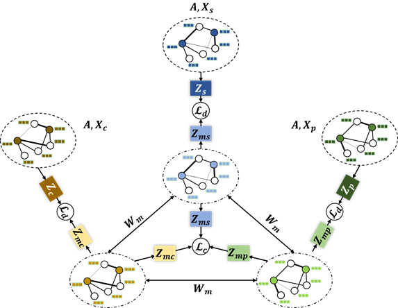

# MuchSum

code for "MuchSUM: A Multi-channel Graph Neural Network for Extractive Summarization"

## Introduction

 MuchSUM is a multi-channel graph convolutional network designed to explicitly incorporate multiple salient summary-worthy features. Specifically,
we introduce three specific graph channels to encode the node textual features, node centrality features, and node position features, respectively, under bipartite word-sentence heterogeneous graphs. We also investigate three weighted graphs in each channel to infuse edge features for graph-based summarization modeling.

This project include the code for graph generation. 



## Graph Generation

`discrete_imp.py`:  discretize the importance feature of graph nodes.

`gendata.py`: generate graph based on the given data in which sentence is splitted

`get_importance_index.py`: calculate node importance according to the generated graph


## Citation

```
@article{MaoLPLHGHW21,
  author    = {Qianren Mao and
               Hongdong Zhu and
               Junnan Li and
               Cheng Ji and
               Hao Peng and
               Jianxin Li and
               Lihong Wang and
               Zheng Wang},
  title     = {MuchSUM: A Multi-channel Graph Neural Network for Extractive Summarization},
  journal   = {},
  volume    = {},
  pages     = {},
  year      = {2022},
  url       = {},
  doi       = {},
  timestamp = {},
  biburl    = {},
  bibsource = {}
```

